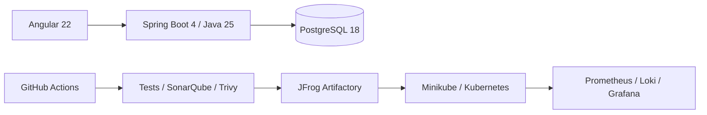

# DevOps Store — DevSecOps Product Catalog

DevOps Store est un mini-catalogue de produits électroniques conçu comme un laboratoire
DevSecOps de bout en bout. Le périmètre métier reste volontairement limité au CRUD, à la
recherche, aux filtres et à la pagination afin de concentrer l'apprentissage sur la chaîne de
livraison.

> État actuel : l'API Products, l'authentification JWT avec refresh rotatif, le RBAC et le socle
> Angular sécurisé sont opérationnels. Le CRUD produits dans la console reste à construire selon
> le [plan d'implémentation](docs/IMPLEMENTATION_PLAN.md).

## Architecture



## Stack

| Zone | Technologies |
|---|---|
| Application | Angular 22, TypeScript 6, Java 25, Spring Boot 4.1, PostgreSQL 18 |
| Build et tests | npm, Maven, Vitest, JUnit 5, Mockito, Testcontainers |
| DevSecOps | GitHub Actions, SonarQube Community Build, Trivy, JFrog Artifactory |
| Infrastructure | Docker Compose, Terraform, Kubernetes, Minikube |
| Observabilité | Actuator, Micrometer, Prometheus, Grafana, Loki, Grafana Alloy |
| Planification | Jira, Confluence |

## Prérequis

- Docker et Docker Compose ;
- Node.js 24 et npm 11 ;
- JDK 25, ou Docker pour utiliser l'image Maven/JDK 25 de référence ;
- Git ;
- Terraform, kubectl, Minikube et GNU Make pour les phases d'infrastructure.

Les versions de référence et l'état de l'outillage local sont détaillés dans le
[plan](docs/IMPLEMENTATION_PLAN.md#socle-de-versions).

## Quick Start

Le backend se valide avec un JDK 25 :

```bash
cd backend
./mvnw clean verify
```

Le frontend se lance séparément :

```bash
cd frontend
npm start
```

Les contrôles frontend disponibles sont `npm run lint`, `npm run test:ci`, `npm run build` et
`npm run e2e`. Le backend local exige PostgreSQL ainsi que les variables d'identité documentées
dans [`.env.example`](.env.example).

Le démarrage en une commande sera disponible à partir de la phase Docker :

```bash
docker compose up -d
```

## URLs prévues

| Service | URL locale |
|---|---|
| Frontend | <http://localhost:4200> |
| Backend | <http://localhost:8080> |
| Swagger UI | <http://localhost:8080/swagger-ui.html> |
| SonarQube | <http://localhost:9000> |
| JFrog | <http://localhost:8082> |
| Prometheus | <http://localhost:9090> |
| Grafana | <http://localhost:3000> |

## Commandes principales

```bash
make help
make test
make docker-up
make devops-up
make k8s-deploy
```

Ces commandes seront ajoutées au fil des phases correspondantes.

## Documentation

- [Index documentaire](docs/README.md)
- [Plan d'implémentation](docs/IMPLEMENTATION_PLAN.md)
- [Cahier des charges](Prompt-DevSecOps-Lab.md)
