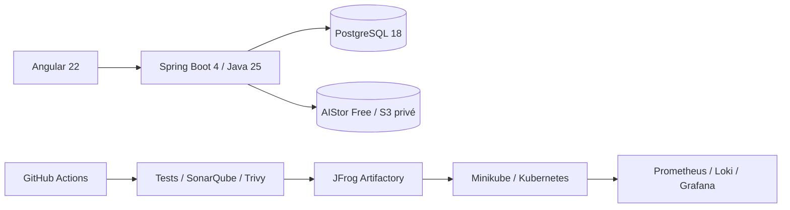

# DevOps Store — DevSecOps Product Catalog

DevOps Store est un mini-catalogue de produits électroniques conçu comme un laboratoire
DevSecOps de bout en bout. Le périmètre métier reste volontairement limité au CRUD, à la
recherche, aux filtres et à la pagination afin de concentrer l'apprentissage sur la chaîne de
livraison.

> État actuel : l'API Products, sa galerie privée S3, l'authentification JWT avec refresh rotatif,
> le RBAC, le CRUD produits, l'administration Angular et la stack Docker Compose applicative sont
> opérationnels. Les workflows GitHub Actions et Dependabot sont configurés et validés par la
> [Pull Request #6](https://github.com/mouhamadoulo/molo-devops-lab/pull/6). SonarQube analyse
> localement les projets backend et frontend avec leurs tests et leur couverture ; un workflow
> conditionnel prépare la même analyse en CI. Trivy, JFrog, l'infrastructure et l'observabilité
> restent planifiés dans le
> [plan d'implémentation](docs/IMPLEMENTATION_PLAN.md).

## Architecture



## Stack

| Zone | Technologies |
|---|---|
| Application | Angular 22, TypeScript 6, Java 25, Spring Boot 4.1, PostgreSQL 18, AIStor Free |
| Build et tests | npm, Maven, Vitest, JUnit 5, Mockito, Testcontainers |
| DevSecOps | GitHub Actions, SonarQube Community Build, Trivy, JFrog Artifactory |
| Infrastructure | Docker Compose, Terraform, Kubernetes, Minikube |
| Observabilité | Actuator, Micrometer, Prometheus, Grafana, Loki, Grafana Alloy |
| Planification | Jira, Confluence |

## Prérequis

- Docker et Docker Compose ;
- Node.js 24 et npm 11 ;
- JDK 25, ou Docker pour utiliser l'image Maven/JDK 25 de référence ;
- au moins 4 Go de RAM disponibles pour le profil SonarQube local ;
- une licence locale AIStor Free pour les tests et le stockage objet, jamais versionnée ;
- Git ;
- GNU Make est optionnel ; les commandes Docker Compose directes sont documentées pour Windows ;
- Terraform, kubectl et Minikube restent requis uniquement pour les phases d'infrastructure à venir.

Les versions de référence et l'état de l'outillage local sont détaillés dans le
[plan](docs/IMPLEMENTATION_PLAN.md#socle-de-versions).

## Quick Start

Copier [`.env.example`](.env.example) vers `.env`, puis renseigner les valeurs laissées vides et
faire pointer `MINIO_LICENSE_FILE` vers la licence AIStor locale. Depuis la racine :

```bash
docker compose config
docker compose build --pull
docker compose up -d --wait
docker compose ps
```

Avec GNU Make, `make application` remplace les commandes de build et de démarrage. L'arrêt normal
préserve les données : `docker compose down` ou `make down`.

Les tests natifs restent disponibles avec `./mvnw clean verify` dans `backend/`, puis `npm ci`,
`npm run lint`, `npm run test:ci`, `npm run build` et `npm run e2e` dans `frontend/`.

## URLs locales

| Service | URL locale |
|---|---|
| Frontend | <http://localhost:4200> |
| Backend | <http://localhost:8080> |
| Swagger UI | <http://localhost:8080/swagger-ui.html> |
| Stockage objet S3 | <http://localhost:9000> |
| Console AIStor | <http://localhost:9001> |
| SonarQube (profil `quality`) | <http://localhost:9000> |

AIStor et SonarQube utilisent tous deux le port 9000 par défaut. Pour les exécuter en parallèle,
modifier `SONAR_PORT` comme indiqué dans le [guide SonarQube](docs/devops/sonarqube.md).

## Commandes principales

```bash
make help
make application
make test
make status
make logs
make down
make quality-up
make sonar
make quality-down
```

## Documentation

- [Index documentaire](docs/README.md)
- [Images et stack Docker Compose](docs/infrastructure/docker.md)
- [Workflow Git et GitHub](docs/devops/git-workflow.md)
- [GitHub Actions](docs/devops/github-actions.md)
- [Qualité SonarQube](docs/devops/sonarqube.md)
- [Plan d'implémentation](docs/IMPLEMENTATION_PLAN.md)
- [Cahier des charges](Prompt-DevSecOps-Lab.md)
