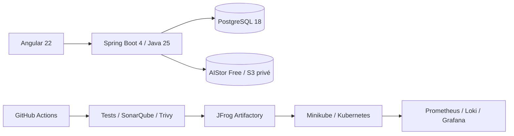

# DevOps Store — DevSecOps Product Catalog

DevOps Store est un mini-catalogue de produits électroniques conçu comme un laboratoire
DevSecOps de bout en bout. Le périmètre métier reste volontairement limité au CRUD, à la
recherche, aux filtres et à la pagination afin de concentrer l'apprentissage sur la chaîne de
livraison.

> État actuel : l'API Products, sa galerie privée S3, l'authentification JWT avec refresh rotatif,
> le RBAC, le CRUD produits et l'administration Angular des utilisateurs sont opérationnels.
> Les images applicatives, pipelines et briques d'observabilité restent planifiés dans le
> [plan d'implémentation](docs/IMPLEMENTATION_PLAN.md).

## Architecture



## Stack

| Zone | Technologies |
|---|---|
| Application | Angular 22, TypeScript 6, Java 25, Spring Boot 4.1, PostgreSQL 18, AIStor Free |
| Build et tests | npm, Maven, Vitest, JUnit 5, Mockito, Testcontainers |
| DevSecOps | GitHub Actions, SonarQube Community Build, Trivy, JFrog Artifactory |
| Infrastructure | Docker Compose, Terraform, Kubernetes, Minikube |
| Observabilité | Actuator, Micrometer, Prometheus, Grafana, Loki, Grafana Alloy |
| Planification | Jira, Confluence |

## Prérequis

- Docker et Docker Compose ;
- Node.js 24 et npm 11 ;
- JDK 25, ou Docker pour utiliser l'image Maven/JDK 25 de référence ;
- une licence locale AIStor Free pour les tests et le stockage objet, jamais versionnée ;
- Git ;
- Terraform, kubectl, Minikube et GNU Make pour les phases d'infrastructure.

Les versions de référence et l'état de l'outillage local sont détaillés dans le
[plan](docs/IMPLEMENTATION_PLAN.md#socle-de-versions).

## Quick Start

Le backend se valide avec un JDK 25 :

```bash
cd backend
./mvnw clean verify
```

Le frontend se lance séparément :

```bash
cd frontend
npm start
```

Les contrôles frontend disponibles sont `npm run lint`, `npm run test:ci`, `npm run build` et
`npm run e2e`. Le backend local exige PostgreSQL, AIStor Free ainsi que les variables d'identité
et de stockage documentées dans [`.env.example`](.env.example).

Après avoir créé un `.env` local, renseigné `MINIO_SECRET_KEY` et placé la licence au chemin
`MINIO_LICENSE_FILE`, les dépendances de données démarrent depuis la racine :

```bash
docker compose up -d postgres object-storage
```

Les images Docker du backend et du frontend restent prévues pour une phase ultérieure.

## URLs prévues

| Service | URL locale |
|---|---|
| Frontend | <http://localhost:4200> |
| Backend | <http://localhost:8080> |
| Swagger UI | <http://localhost:8080/swagger-ui.html> |
| Stockage objet S3 | <http://localhost:9000> |
| Console AIStor | <http://localhost:9001> |
| SonarQube | <http://localhost:9000> (planifié ; port partagé avec AIStor, services non simultanés sans reconfiguration) |
| JFrog | <http://localhost:8082> |
| Prometheus | <http://localhost:9090> |
| Grafana | <http://localhost:3000> |

## Commandes principales

```bash
make help
make test
make docker-up
make devops-up
make k8s-deploy
```

Ces commandes seront ajoutées au fil des phases correspondantes.

## Documentation

- [Index documentaire](docs/README.md)
- [Plan d'implémentation](docs/IMPLEMENTATION_PLAN.md)
- [Cahier des charges](Prompt-DevSecOps-Lab.md)
