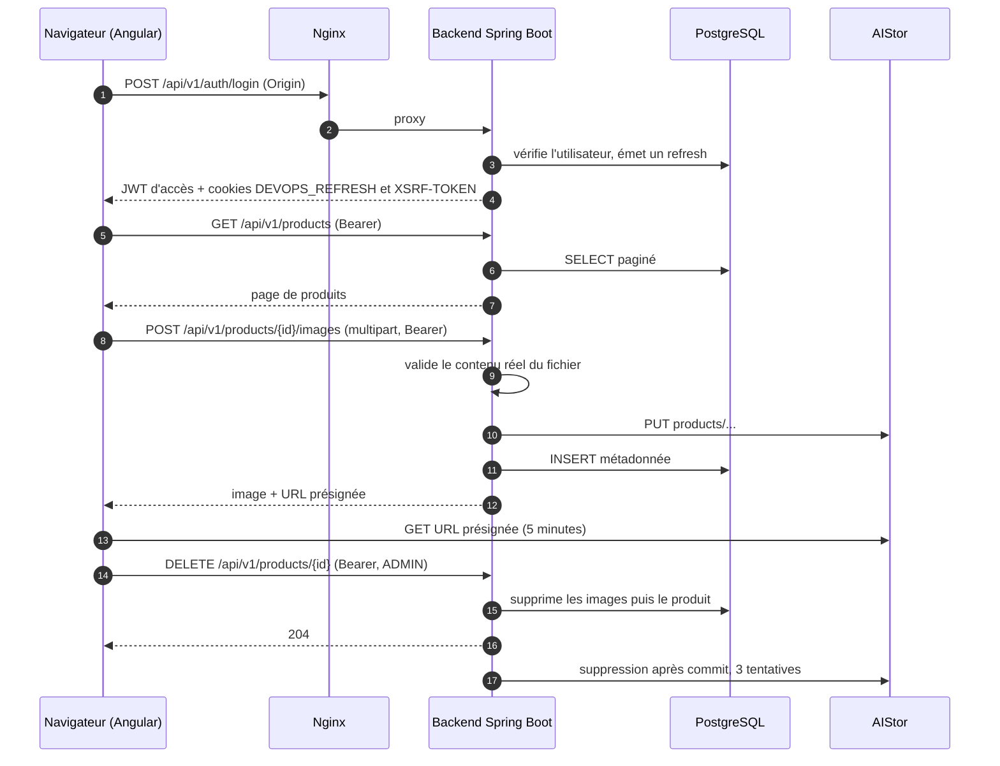

# Vue d'ensemble de l'architecture

Ce document donne la vue globale du laboratoire : les composants, le chemin réel d'une requête,
les rôles et les décisions qui structurent le code. Les détails d'exploitation restent dans les
guides dédiés, référencés à chaque section.

## Composants

| Composant | Rôle | Technologie | Guide |
|---|---|---|---|
| Frontend | Console produits et administration, servie en statique | Angular 22, TypeScript 6, build Node 24, runtime `nginx-unprivileged` 1.31.5 en UID 101 | [Images et stack Docker Compose](../infrastructure/docker.md) |
| Backend | API REST `/api/v1`, identité, règles métier | Spring Boot 4.1.1 sur Java 25, runtime JRE 25 en UID 10001 | [Tests et couverture](../devops/testing.md) |
| Base de données | Catalogue, utilisateurs, jetons de rafraîchissement, métadonnées d'images | PostgreSQL 18.4, schéma géré par Flyway | `backend/src/main/resources/db/migration/` |
| Stockage objet | Contenu binaire des images produits, privé | AIStor Free single-node, client MinIO Java 9 | [Décision stockage objet](object-storage-decision.md) |
| Supervision | Santé, métriques Prometheus, logs structurés | Actuator sur le port de management `8081`, Micrometer, format Logstash | [Prometheus](../observability/prometheus.md) |

Le backend est organisé par fonctionnalité (`identity`, `product`, `common/web`) puis par couche
(`api`, `application`, `domain`, `infrastructure`). Le frontend suit la même logique :
`core/` (session, intercepteurs HTTP, shell), `features/` (`auth`, `products`, `users`, `errors`)
et `shared/ui`, avec des routes chargées à la demande derrière un guard.

## Flux d'une requête

**Connexion.** `POST /api/v1/auth/login` exige un en-tête `Origin` strictement égal à
`CORS_ALLOWED_ORIGIN`, sinon la requête est refusée. La réponse porte un JWT d'accès HS256
(durée 15 minutes) conservé **en mémoire** par Angular, jamais dans `localStorage`. Deux cookies
`SameSite=Strict` l'accompagnent : `DEVOPS_REFRESH`, `HttpOnly`, limité au chemin `/api/v1/auth`,
et `XSRF-TOKEN`, lisible, dont la valeur doit être renvoyée dans l'en-tête `X-XSRF-TOKEN` sur
`refresh` et `logout`. Le rafraîchissement est **rotatif** : chaque jeton n'est consommable
qu'une fois, et la réutilisation d'un jeton déjà consommé ou révoqué révoque toute la famille.
Seul le condensé SHA-256 du jeton est stocké.

**Lecture et écriture des produits.** Le contrôleur valide l'entrée et délègue au service
applicatif, transactionnel, qui passe par un repository Spring Data vers PostgreSQL. Les
propriétés de tri sont validées avant d'atteindre JPA. Toute erreur sort en `ProblemDetail`
`application/problem+json`, enrichie du `X-Request-ID` propagé ou généré par le filtre de
`common/web`.

**Galerie.** L'upload est limité à cinq images par produit et 6 Mo par requête. Le fichier n'est
pas accepté sur la foi de son nom ou de son type déclaré : son contenu est inspecté, seuls JPEG,
PNG et WebP passent, et les variantes animées sont refusées. L'objet part dans AIStor sous le
préfixe `products/`, la métadonnée dans PostgreSQL. La lecture ne fait jamais transiter l'objet
par le backend : le client reçoit une URL présignée valable cinq minutes.

**Suppression.** La base porte le `ON DELETE CASCADE`, mais le service supprime explicitement les
images avant leur produit pour rester cohérent avec la session Hibernate. La suppression de
l'objet distant n'est pas faite dans la transaction : un événement `ObjectDeletionRequested` est
traité **après commit**, avec au plus trois tentatives, et compté par les métriques
`product.images.storage.deletion.retries` et `.failures`. Un reconciler planifié compare ensuite
le préfixe `products/` aux clés référencées et ne supprime que les orphelins plus anciens que la
fenêtre de sécurité (`MINIO_ORPHAN_MIN_AGE`, 24 h par défaut).

## Rôles et accès

| Rôle | Peut |
|---|---|
| `VIEWER` | lire le catalogue et les images |
| `EDITOR` | en plus, créer et modifier un produit, ajouter, réordonner et supprimer ses images |
| `ADMIN` | en plus, **supprimer un produit** et administrer les utilisateurs (`/api/v1/users/**`) |

La suppression d'un produit est réservée à `ADMIN` ; la suppression d'une image seule reste
ouverte à `EDITOR`. Les rôles viennent de la revendication `role` du JWT, convertie en autorité
`ROLE_*`.

## Décisions structurantes

- **Organisation par fonctionnalité puis par couche** : un domaine métier se lit dans un seul
  dossier, sans parcourir quatre paquets techniques.
- **Flyway avec `ddl-auto=validate`** : le schéma appartient aux migrations versionnées, Hibernate
  ne le modifie jamais. Une migration appliquée n'est pas retouchée, on en ajoute une.
- **JWT d'accès en mémoire, refresh rotatif en cookie `HttpOnly`** : réduit l'exposition au vol de
  jeton par script, et permet la révocation de famille en cas de rejeu.
- **Stockage objet privé à URL présignée** : aucun bucket public, aucun objet servi par le
  backend, voir [Décision stockage objet](object-storage-decision.md).
- **Actuator sur un port de management séparé** (`8081`, non publié sur l'hôte) et limité à
  `health`, `info` et `prometheus`.
- **Images épinglées par digest et exécutées sans racine** (UID 10001 côté backend, 101 côté
  Nginx), voir [Images et stack Docker Compose](../infrastructure/docker.md).
- **Suppression du binaire après commit, jamais pendant** : la base reste la source de vérité et
  un échec de stockage ne fait pas échouer la transaction.

## Environnements d'exécution

| Environnement | Ce qui tourne | Guide |
|---|---|---|
| Docker Compose local | Nginx, backend, PostgreSQL, AIStor avec healthchecks | [Images et stack Docker Compose](../infrastructure/docker.md) |
| Profils DevOps | SonarQube, Artifactory, Prometheus, Grafana, Loki, Alloy | [SonarQube](../devops/sonarqube.md), [JFrog Artifactory](../devops/jfrog-artifactory.md), [Prometheus](../observability/prometheus.md) |
| Kubernetes Docker Desktop | StatefulSets PostgreSQL et AIStor, Deployments backend et frontend | [Kubernetes local](../infrastructure/kubernetes.md) |
| GitHub Actions | Build, tests, qualité, sécurité, images, documentation | [GitHub Actions](../devops/github-actions.md) |

URL, ports, identifiants initiaux et commandes de nettoyage de chaque stack :
[Services et accès](../operations/services.md).
