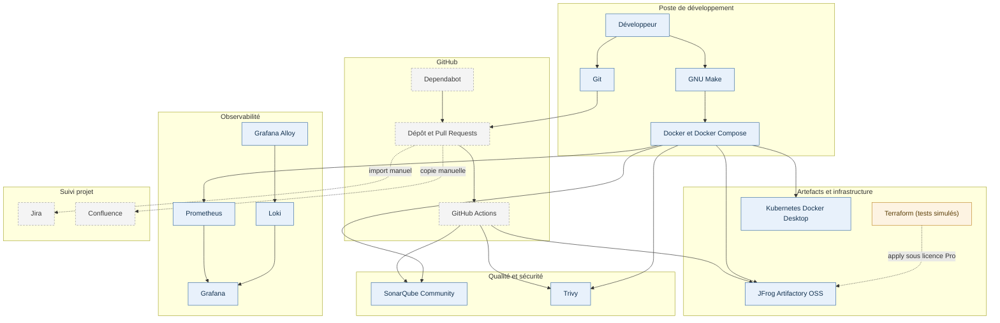

# Chaîne d'outils DevSecOps

Ce document décrit la chaîne réellement en place, pas la chaîne idéale : chaque outil y est listé
avec sa version, l'endroit où il s'exécute et le guide qui le détaille. Les écarts avec le cahier
des charges sont regroupés en fin de page.

## Chaîne de bout en bout

Légende : en bleu ce qui tourne sur le poste, en gris ce qui est hébergé hors du poste, en orange
ce qui exige une licence non disponible ici. Les traits pointillés sont des étapes manuelles ou
bloquées par une licence.

## Outils

| Outil | Rôle | Version | Exécution | Guide |
|---|---|---|---|---|
| Git | Historique, branches courtes, worktrees | — | Locale | [Workflow Git et GitHub](git-workflow.md) |
| GitHub | Dépôt distant, Pull Requests, revue | — | Externe | [Workflow Git et GitHub](git-workflow.md) |
| GitHub Actions | CI : build, tests, images, qualité, sécurité, liens | — | GitHub | [GitHub Actions](github-actions.md) |
| Dependabot | Mises à jour de dépendances et d'actions | — | GitHub | [GitHub Actions](github-actions.md) |
| Docker / Compose | Images multi-stage et stacks locales | Compose 5.1 | Locale | [Images et stack Docker Compose](../infrastructure/docker.md) |
| GNU Make | Point d'entrée unique des commandes | — | Locale | `Makefile` |
| SonarQube Community | Qualité, couverture, quality gate | 26.9 | Locale (profil `quality`) | [SonarQube](sonarqube.md) |
| Trivy | Dépôt, dépendances, configurations et images | 0.73.0 | Locale et GitHub | [Trivy](trivy.md) |
| JFrog Artifactory OSS | Artefacts Maven, promotion par checksum | 7.161.26 | Locale (profil `artifacts`) | [JFrog Artifactory](jfrog-artifactory.md) |
| Terraform | Description des repositories JFrog | 1.15.4, provider 12.11.3 | Locale, **tests simulés uniquement** | [Terraform et JFrog](../infrastructure/terraform.md) |
| Kubernetes | Déploiement de la stack applicative | 1.36.1 (containerd 2.3.1) | Locale (Docker Desktop) | [Kubernetes local](../infrastructure/kubernetes.md) |
| Prometheus | Collecte des métriques Actuator | 3.14.0 | Locale (profil `observability`) | [Prometheus](../observability/prometheus.md) |
| Grafana | Dashboards provisionnés | 13.2.1 | Locale (profil `observability`) | [Grafana](../observability/grafana.md) |
| Loki | Stockage et requêtes des journaux | 3.7.7 | Locale (profil `observability`) | [Loki](../observability/loki.md) |
| Grafana Alloy | Collecte des journaux de conteneurs | 1.19.2 | Locale (profil `observability`) | [Alloy](../observability/alloy.md) |
| Jira | Backlog, epics et stories | — | Externe, **import manuel** | [Jira et Confluence](../planning/jira-confluence.md) |
| Confluence | Publication de la documentation | — | Externe, **copie manuelle** | [Jira et Confluence](../planning/jira-confluence.md) |

## Parcours d'une modification

1. Branche courte créée depuis un `main` à jour, dans un worktree isolé.
2. Validations locales proportionnées au code touché : `make backend-test`, `make frontend-test`,
   `make docs-check`, `make security` selon le périmètre.
3. Pull Request vers `main` ; aucun push direct sur `main`.
4. La CI déclenche les workflows concernés par les chemins modifiés : `Backend CI`,
   `Frontend CI`, `Docker CI`, `Quality`, `Security` et `Documentation`.
5. Fusion après CI verte et revue, puis suppression de la branche et du worktree.
6. La publication d'artefacts vers Artifactory reste **conditionnelle** : elle n'a lieu que si les
   secrets JFrog sont présents, sinon l'étape est sautée sans faire échouer la CI.

Détail des déclencheurs, permissions et secrets : [GitHub Actions](github-actions.md).

## Écarts avec la cible du cahier des charges

| Cible | Réalité | Raison |
|---|---|---|
| Minikube | Kubernetes intégré de Docker Desktop | aucun binaire Minikube pour Windows ARM64 |
| Terraform appliqué sur Artifactory | configuration validée par `terraform test` seulement | les API de configuration des repositories sont réservées à Artifactory Pro |
| Jira et Confluence synchronisés | backlog CSV importable et guide de copie | aucun compte Jira/Confluence rattaché au laboratoire |
| Artifactory Pro | Artifactory OSS | licence ; les repositories sont créés une fois dans l'interface puis vérifiés par `make artifacts-verify` |
