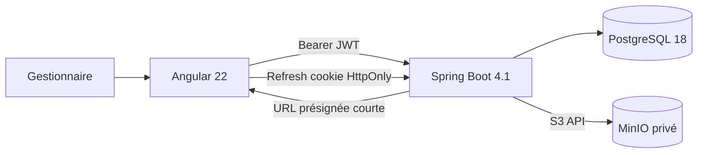

# Design — Console produits sécurisée

- **Date :** 18 août 2026
- **Statut :** validé en conversation, en attente de revue du document
- **Périmètre :** Angular 22, authentification JWT Spring Boot, rôles et images MinIO

## Contexte

DevOps Store dispose actuellement d'une API Spring Boot opérationnelle pour le catalogue de
produits. La prochaine évolution doit fournir une console Angular destinée à des gestionnaires
internes, utilisable avec la même qualité sur desktop et mobile.

Le périmètre initial du frontend est étendu à deux capacités backend nécessaires à cette console :

1. une authentification interne avec autorisations par rôle ;
2. une galerie d'images produits stockée dans MinIO.

Ces capacités sont livrées par incréments afin de conserver des frontières claires et des tests
isolables.

## Objectifs

- Livrer une console Angular 22 standalone couvrant le CRUD produits, les filtres, le tri et la
  pagination.
- Proposer une interface de type console opérationnelle, dense sur desktop et tactile sur mobile.
- Sécuriser le backend et le frontend avec les rôles `ADMIN`, `EDITOR` et `VIEWER`.
- Utiliser un access token JWT court et un refresh token rotatif protégé.
- Permettre jusqu'à cinq images ordonnées par produit, avec une image principale.
- Stocker les objets dans un bucket MinIO privé et les métadonnées dans PostgreSQL.
- Rendre les états de chargement, erreur, absence de données et succès explicites et accessibles.
- Valider les parcours critiques avec tests unitaires, intégration et end-to-end.

## Hors périmètre

- inscription publique ;
- connexion via un fournisseur OIDC externe ;
- paiement, panier ou commandes ;
- galerie de plus de cinq images ;
- bucket d'images public ;
- application mobile native ;
- gestion de rôles personnalisés ou de permissions configurables ;
- suppression définitive des comptes utilisateurs.

## Décisions structurantes

| Sujet | Décision |
|---|---|
| Public | Gestionnaires internes |
| Direction UI | Console opérationnelle |
| Responsive | Desktop et mobile de même importance |
| UI Angular | Angular Material avec thème personnalisé |
| État frontend | API Observable, stores Signals |
| Authentification | Utilisateurs PostgreSQL et JWT Spring Boot |
| Session | JWT 15 min en mémoire, refresh opaque 7 jours en cookie `HttpOnly` |
| Rôles | `ADMIN`, `EDITOR`, `VIEWER` |
| Provisioning | Administrateur initial par variables d'environnement |
| Images | Galerie de cinq images, une principale |
| Stockage | MinIO privé et métadonnées PostgreSQL |

## Séquence de livraison

1. Scaffolder le frontend Angular strict avec Material, ESLint et Playwright.
2. Implémenter l'authentification et les autorisations côté backend.
3. Implémenter login, restauration de session, guards et shell Angular.
4. Ajouter MinIO, le modèle d'images et les endpoints backend.
5. Construire la console produits, les formulaires et la galerie responsive.
6. Construire l'administration des utilisateurs.
7. Exécuter les validations complètes et mettre à jour la documentation.

Chaque incrément doit rester exécutable et vérifiable avant le suivant.

## Architecture globale



Le backend reste l'autorité pour l'authentification, les rôles, les validations métier et les
droits sur les images. Le frontend adapte la navigation et les actions disponibles, sans remplacer
les contrôles serveur.

## Authentification et autorisations

### Modèle utilisateur

Une migration Flyway ajoute une table `app_users` contenant :

- `id` bigint généré ;
- `email` normalisé et unique ;
- `display_name` ;
- `password_hash` BCrypt ;
- `role` parmi `ADMIN`, `EDITOR`, `VIEWER` ;
- `enabled` ;
- `created_at` et `updated_at` en `timestamptz`.

Les comptes ne sont pas supprimés physiquement. Un administrateur peut les désactiver. Le service
refuse la désactivation du dernier administrateur actif et la désactivation du compte courant.

### Administrateur initial

Au démarrage, un composant idempotent crée le premier administrateur uniquement lorsqu'aucun
administrateur n'existe. Les valeurs viennent de :

- `BOOTSTRAP_ADMIN_EMAIL` ;
- `BOOTSTRAP_ADMIN_PASSWORD` ;
- `BOOTSTRAP_ADMIN_NAME`.

Le mot de passe n'est jamais journalisé ni versionné. Le démarrage échoue clairement si la base est
vide et que les valeurs de bootstrap nécessaires sont absentes.

### Access token

- JWT signé avec un secret HMAC fourni par `JWT_SECRET` ;
- secret d'au moins 32 octets ;
- durée de vie de 15 minutes ;
- claims minimaux : sujet utilisateur, rôle, issuer, issued-at et expiration ;
- aucun mot de passe, refresh token ou donnée sensible dans les claims.

Angular conserve l'access token uniquement en mémoire.

### Refresh token

Le refresh token est une valeur aléatoire opaque de 256 bits :

- durée de vie de 7 jours ;
- transmis dans un cookie `HttpOnly`, `SameSite=Strict`, limité au chemin d'authentification ;
- attribut `Secure` obligatoire hors développement local ;
- stocké sous forme de hash SHA-256 dans `refresh_tokens` ;
- associé à l'utilisateur, une famille de rotation, une date d'expiration et une éventuelle date de
  révocation.

Chaque rafraîchissement révoque le token précédent et en crée un nouveau. La réutilisation d'un
token déjà consommé révoque toute sa famille.

### Protection CSRF et CORS

Les endpoints qui utilisent le cookie de refresh vérifient :

- l'origine autorisée ;
- un token XSRF distinct envoyé par cookie lisible et en-tête `X-XSRF-TOKEN` ;
- `credentials: include` uniquement pour login, refresh et logout.

Le CORS n'autorise qu'une origine configurée, les méthodes nécessaires et les en-têtes attendus.

### Endpoints d'authentification

| Méthode | Route | Description |
|---|---|---|
| `POST` | `/api/v1/auth/login` | Authentifie, retourne l'access token et pose les cookies refresh/XSRF |
| `POST` | `/api/v1/auth/refresh` | Effectue une rotation et retourne un nouvel access token |
| `POST` | `/api/v1/auth/logout` | Révoque la famille active et supprime les cookies |
| `GET` | `/api/v1/auth/me` | Retourne l'utilisateur courant et son rôle |

Il n'existe aucun endpoint d'inscription publique.

### Administration des utilisateurs

Les routes `/api/v1/users` sont réservées à `ADMIN` :

- liste paginée ;
- création avec mot de passe initial ;
- mise à jour du nom et du rôle ;
- activation et désactivation ;
- réinitialisation explicite du mot de passe.

### Matrice des droits

| Action | VIEWER | EDITOR | ADMIN |
|---|:---:|:---:|:---:|
| Consulter produits et images | Oui | Oui | Oui |
| Créer et modifier un produit | Non | Oui | Oui |
| Ajouter, ordonner et supprimer des images | Non | Oui | Oui |
| Supprimer un produit | Non | Non | Oui |
| Administrer les utilisateurs | Non | Non | Oui |

`/actuator/health` reste public. `info`, `prometheus`, Swagger UI et OpenAPI exigent un utilisateur
authentifié ; `prometheus` pourra recevoir une authentification dédiée lors de la phase
observabilité.

## Images produits

### Stockage

MinIO expose une API compatible S3. Le bucket est privé et créé de manière idempotente au
démarrage local si nécessaire. Les objets utilisent une clé non prédictible :

```text
products/{productId}/{uuid}
```

Le nom d'origine n'est jamais utilisé comme clé.

### Métadonnées

Une migration Flyway ajoute `product_images` :

- `id` bigint généré ;
- `product_id` avec suppression en cascade ;
- `object_key` unique ;
- `content_type` ;
- `size_bytes` ;
- `width` et `height` ;
- `position` entre 0 et 4 ;
- `is_primary` ;
- `created_at`.

Une contrainte et un index partiel garantissent au plus une image principale par produit. Le
service garantit au plus cinq lignes et des positions uniques par produit.

### Validation des fichiers

- types autorisés : JPEG, PNG et WebP ;
- taille maximale : 5 Mo ;
- dimensions maximales : 4096 × 4096 ;
- SVG et formats animés refusés ;
- type déterminé à partir du contenu réel et décodage de l'image ;
- nom d'origine traité uniquement comme métadonnée non fiable et non réaffiché sans échappement.

### Endpoints d'images

| Méthode | Route | Rôle minimal |
|---|---|---|
| `GET` | `/api/v1/products/{productId}/images` | `VIEWER` |
| `POST` | `/api/v1/products/{productId}/images` | `EDITOR` |
| `PUT` | `/api/v1/products/{productId}/images/order` | `EDITOR` |
| `PUT` | `/api/v1/products/{productId}/images/{imageId}/primary` | `EDITOR` |
| `DELETE` | `/api/v1/products/{productId}/images/{imageId}` | `EDITOR` |

L'upload utilise `multipart/form-data`. Les réponses de lecture contiennent des URLs GET
présignées valides cinq minutes. La liste produits ne reçoit que l'image principale ; le détail
charge la galerie complète.

### Cohérence MinIO/PostgreSQL

Upload : valider, envoyer l'objet, persister les métadonnées. Si la persistance échoue, supprimer
l'objet par compensation.

Suppression : supprimer les métadonnées dans la transaction et publier un événement traité après
commit pour supprimer l'objet. Si MinIO échoue, l'objet n'est plus accessible par URL présignée ;
la tâche de nettoyage le réessaie et la réconciliation périodique élimine les objets orphelins.

La suppression d'un produit nettoie ses objets avant la suppression relationnelle. Les erreurs de
stockage utilisent des Problem Details distincts et conservent le `requestId`.

## Architecture Angular

### Structure

```text
frontend/src/app/
├── core/
│   ├── auth/
│   ├── config/
│   ├── http/
│   └── layout/
├── shared/
│   └── ui/
├── features/
│   ├── auth/
│   ├── products/
│   │   ├── components/
│   │   ├── models/
│   │   ├── pages/
│   │   ├── services/
│   │   └── products.routes.ts
│   └── users/
└── app.routes.ts
```

Tous les composants sont standalone. Les features sont lazy-loaded. TypeScript et les templates
sont stricts. Aucun NgModule n'est ajouté sans contrainte technique documentée.

### Routes

| Route | Accès |
|---|---|
| `/login` | Public |
| `/products` | Tout utilisateur authentifié |
| `/products/new` | `EDITOR`, `ADMIN` |
| `/products/:id` | Tout utilisateur authentifié |
| `/products/:id/edit` | `EDITOR`, `ADMIN` |
| `/users` | `ADMIN` |

Le shell protégé contient une sidebar desktop et une navigation basse mobile. Les routes
interdites redirigent vers une page `403`, sans remplacer les contrôles backend.

### Gestion de session

`AuthStore` expose des Signals pour : utilisateur, rôle, état de restauration, état authentifié et
erreur. Au démarrage, il tente un refresh avant d'afficher le shell.

Un intercepteur fonctionnel ajoute le Bearer token. En cas de réponses `401` concurrentes, une
seule requête de refresh est partagée. Chaque requête initiale est rejouée une fois au maximum. Un
échec de refresh vide la session et redirige vers `/login`.

### Catalogue et paramètres d'URL

L'URL est la source de vérité pour :

- recherche ;
- catégorie ;
- disponibilité ;
- page et taille ;
- propriété et direction de tri.

`ProductsApi` expose des Observables. `ProductsStore` transforme les résultats en Signals et publie
explicitement `loading`, `error`, `empty` ou `success`. Les mutations ponctuelles utilisent
`firstValueFrom`, puis rechargent l'état pertinent.

Le même état alimente :

- un tableau dense avec filtres complets sur desktop ;
- des cartes tactiles et des chips de filtres sur mobile.

### Formulaires et galerie

Les formulaires produits et utilisateurs utilisent des Reactive Forms strictement typés. Les
erreurs backend de champs sont rapprochées des contrôles correspondants.

Le gestionnaire de galerie fournit :

- sélection multiple et glisser-déposer ;
- prévisualisation locale ;
- progression d'upload ;
- réorganisation ;
- choix de l'image principale ;
- suppression confirmée ;
- messages accessibles pour les rejets de fichiers.

### Angular Material et identité visuelle

Angular Material fournit formulaires, dialogs, menus, snackbar, paginator et primitives de table.
Un thème SCSS personnalisé conserve la direction « console opérationnelle » :

- navigation bleu nuit ;
- accent bleu franc ;
- surfaces claires et bordures slate ;
- densité desktop maîtrisée ;
- cibles tactiles d'au moins 44 px sur mobile ;
- contraste conforme WCAG AA.

Les composants ne reposent pas sur l'apparence Material par défaut pour définir l'identité du
produit.

## Erreurs et accessibilité

Le frontend convertit les Problem Details en erreurs typées. Il affiche :

- erreurs de champs près des contrôles ;
- panne globale avec action de nouvelle tentative ;
- `requestId` pour le support ;
- snackbar pour les succès non bloquants ;
- confirmation avant les actions destructrices.

Les quatre états de données sont distincts : chargement avec skeleton, erreur, liste réellement
vide et résultat de filtres vide.

Les dialogs restaurent le focus. Les changements importants utilisent `aria-live`. Toutes les
actions sont utilisables au clavier et les labels ne reposent pas uniquement sur la couleur.

## Configuration

Variables backend ajoutées :

- `JWT_SECRET` ;
- `JWT_ISSUER` avec valeur locale `devops-store` ;
- `BOOTSTRAP_ADMIN_EMAIL` ;
- `BOOTSTRAP_ADMIN_PASSWORD` ;
- `BOOTSTRAP_ADMIN_NAME` ;
- `MINIO_ENDPOINT` ;
- `MINIO_ACCESS_KEY` ;
- `MINIO_SECRET_KEY` ;
- `MINIO_BUCKET` avec valeur locale `devops-store-products` ;
- `AUTH_COOKIE_SECURE` activé hors développement local.

Un `.env.example` documente les noms et valeurs de développement non sensibles. Aucun secret réel
n'est versionné.

Un `docker-compose.yml` minimal démarre PostgreSQL et MinIO pour le développement. La phase Docker
ultérieure y ajoutera les images frontend et backend sans créer une seconde stack concurrente.

## Tests

### Backend

- tests unitaires du service JWT et du hash des refresh tokens ;
- rotation, révocation de famille, expiration et compte désactivé ;
- matrice des rôles sur tous les endpoints protégés ;
- bootstrap administrateur idempotent ;
- validation et limite des images ;
- compensation MinIO/PostgreSQL ;
- tests d'intégration avec PostgreSQL et MinIO via Testcontainers.

### Frontend

- stores Signals et transitions d'état ;
- guards et règles de rôles ;
- intercepteur, refresh partagé et retry unique ;
- formulaires typés et erreurs serveur ;
- tableau desktop et cartes mobile ;
- galerie, limites et progression ;
- ESLint Angular/TypeScript strict.

### End-to-end

Playwright couvre au minimum :

1. login administrateur, création d'un produit, ajout d'image, modification et suppression ;
2. login `VIEWER` et refus des opérations d'écriture ;
3. restauration de session par refresh après rechargement.

## Commandes de validation

```powershell
.\backend\mvnw.cmd clean verify

Set-Location frontend
npm ci
npm run lint
npm test -- --watch=false
npm run build
npx playwright test
```

La configuration locale des services est également vérifiée avec :

```powershell
docker compose config
docker compose up -d postgres minio
docker compose ps
```

## Critères d'acceptation

- Un administrateur peut initialiser le système sans secret versionné.
- Login, refresh rotatif, logout et restauration de session fonctionnent.
- La réutilisation d'un refresh token révoqué invalide sa famille.
- Chaque rôle obtient exactement les permissions de la matrice.
- Un produit peut porter de zéro à cinq images, ordonnées, avec au plus une principale.
- Les fichiers invalides ou trop volumineux sont refusés avec un Problem Detail exploitable.
- La liste, le détail, les formulaires et la galerie fonctionnent sur desktop et mobile.
- Recherche, filtres, tri et pagination sont reflétés dans l'URL.
- Les états loading, error, empty et success sont accessibles et testés.
- Les tests Maven, Vitest, ESLint, build Angular et Playwright passent.
- Aucun secret, token, objet MinIO ou artefact généré n'est ajouté à Git.

## Risques et atténuations

| Risque | Atténuation |
|---|---|
| Erreur de sécurité dans le JWT interne | Token court, secret fort, tests de rôles, aucune donnée sensible dans les claims |
| Vol de refresh token | Cookie HttpOnly/Secure/Strict, rotation et détection de réutilisation |
| XSS côté SPA | Aucun token persistant, templates Angular, CSP lors de la phase Nginx |
| Désynchronisation MinIO/PostgreSQL | Compensation d'upload, suppression après commit et réconciliation des orphelins |
| Fichier malveillant | Liste blanche, inspection du contenu, décodage et limites strictes |
| Interface mobile dégradée | Composition mobile dédiée et critères tactiles/accessibilité |
| Scope trop large | Livraison incrémentale avec validation à chaque frontière |
