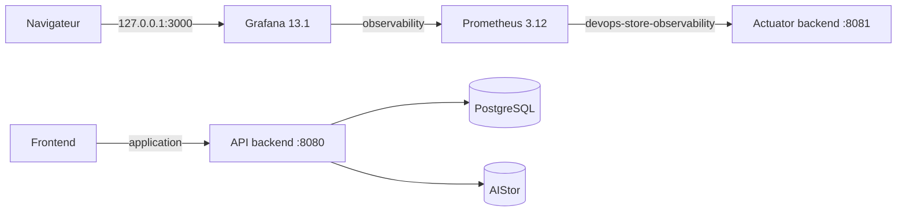

# Design — Observabilité Prometheus et Grafana

- **Date :** 31 août 2026
- **Statut :** validé en conversation
- **Périmètre :** phase 11, métriques Spring Boot, Prometheus 3.12 et Grafana 13.1

## Contexte

DevOps Store expose déjà les métriques Spring Boot et Micrometer sur `/actuator/prometheus`. Le
backend publie notamment le compteur métier `products_created_events_total`, couvert par les tests
du service et de l'API. Il manque encore la collecte durable, le dashboard versionné et le parcours
d'exploitation local prévus par la phase 11.

L'application et les outils DevOps utilisent deux projets Compose indépendants. Cette séparation
est conservée : l'observabilité doit pouvoir être arrêtée ou réinitialisée sans interrompre
l'application ni supprimer PostgreSQL ou les objets produits.

## Objectifs

- collecter les métriques du backend toutes les 15 secondes avec Prometheus ;
- isoler Actuator sur un port Docker interne distinct du port API publié ;
- visualiser santé, trafic, latence, erreurs, CPU, JVM, GC et créations de produits ;
- provisionner Grafana intégralement depuis des fichiers versionnés, sans clic manuel ;
- conserver les données locales dans des volumes nommés avec une rétention Prometheus bornée ;
- fournir des commandes Make et une documentation de démarrage, validation et diagnostic ;
- ne versionner aucun mot de passe, token ou autre secret.

## Hors périmètre

- alertes Prometheus, Alertmanager et notifications ;
- Loki, Grafana Alloy et les panneaux de logs, réservés à la phase 12 ;
- métriques PostgreSQL, AIStor, Nginx ou Docker ;
- déploiement Kubernetes et ServiceMonitor, réservés à la phase 13 ;
- haute disponibilité, stockage distant Prometheus et authentification fédérée Grafana ;
- exposition réseau distante des interfaces Prometheus ou Grafana.

## Décisions validées

| Sujet | Décision |
|---|---|
| Architecture Compose | Deux projets conservés et reliés par un réseau Docker partagé |
| Port API | `8080`, publié uniquement sur `127.0.0.1` |
| Port Actuator Docker | `8081`, non publié sur l'hôte |
| Authentification du scrape | Accès anonyme uniquement lorsque le management écoute sur un port séparé |
| Prometheus | `prom/prometheus:v3.12.0-distroless@sha256:f39df5334dee301b885f77e0ff1159f5d8a43bf9db518f885544594799a1e3c2` |
| Grafana | `grafana/grafana:13.1.0@sha256:121a7a9ece6dc10b969f1f96eed64b4f07dfac0d0b8abc070f7cb83bbde86f63` |
| Rétention Prometheus | 7 jours et 1 Gio au maximum |
| Grafana | Accès anonyme désactivé, utilisateur `admin`, mot de passe obligatoire hors Git |
| Provisioning | Datasource et dashboard montés en lecture seule avec UID stables |
| Exploitation | `observability-up` démarre d'abord l'application ; l'arrêt reste découplé |
| Validation déclarative | Contrôles de configuration et tests d'intégration réels plutôt que tests unitaires de texte |

## Architecture



Le réseau `application` reste privé au projet applicatif. Un second réseau portant le nom Docker
stable `devops-store-observability` est créé par `docker-compose.yml` et reçoit uniquement le
backend. `docker-compose.devops.yml` le déclare comme réseau externe et y attache Prometheus.

Prometheus appartient aussi au réseau privé `observability`, utilisé pour communiquer avec
Grafana. Grafana rejoint également le réseau partagé : Docker ne publie pas son port lorsqu'il
n'est relié qu'à un réseau `internal`. La communication Grafana-Prometheus reste sur le réseau
privé ; aucun outil d'observabilité ne rejoint PostgreSQL ou AIStor.

## Isolation et sécurité d'Actuator

Dans Compose, le backend reçoit `MANAGEMENT_SERVER_PORT=8081`. Le port n'apparaît pas dans
`ports`; il est joignable uniquement par les conteneurs du réseau partagé. Le healthcheck backend
utilise alors `http://localhost:8081/actuator/health` depuis le conteneur.

Une chaîne Spring Security prioritaire utilise `EndpointRequest` et n'est créée que sous
`@ConditionalOnManagementPort(ManagementPortType.DIFFERENT)`. Elle applique les règles suivantes :

- `/actuator/health` et ses sous-chemins sont publics ;
- `/actuator/prometheus` est public pour le scrape interne ;
- tout autre endpoint Actuator est refusé ;
- session, formulaire, HTTP Basic, logout et CSRF sont désactivés sur cette chaîne stateless.

Lorsque l'application utilise un port unique, cette chaîne n'existe pas. La chaîne applicative
actuelle conserve donc son contrat : health public, Prometheus et info authentifiés. Un test sur
port management aléatoire prouve l'ouverture conditionnelle et un test monoport préserve la
protection existante.

## Métriques HTTP et métier

L'histogramme Micrometer est activé pour `http.server.requests`, afin que Prometheus reçoive
`http_server_requests_seconds_bucket` et que le p95 soit calculable. Les métriques JVM, processus,
système et le compteur métier existant ne changent pas.

Prometheus scrape toutes les 15 secondes :

```yaml
scrape_configs:
  - job_name: devops-store-backend
    metrics_path: /actuator/prometheus
    static_configs:
      - targets: [backend:8081]
        labels:
          service: devops-store-backend
          environment: local
```

Le fichier de configuration reste statique et monté en lecture seule. L'API d'administration
Prometheus et le lifecycle reload ne sont pas activés.

## Prometheus

Le service `prometheus` appartient au profil `observability`. Il utilise l'image officielle
`prom/prometheus:v3.12.0-distroless@sha256:f39df5334dee301b885f77e0ff1159f5d8a43bf9db518f885544594799a1e3c2`,
publie `9090` uniquement sur `127.0.0.1` et écrit ses séries dans le volume au nom Docker explicite
`devops-store-prometheus-data`.

Les paramètres de démarrage fixent explicitement :

- le fichier `/etc/prometheus/prometheus.yml` ;
- le stockage `/prometheus` ;
- `--storage.tsdb.retention.time=7d` ;
- `--storage.tsdb.retention.size=1GB`.

Le conteneur applique `no-new-privileges`, supprime toutes les capacités Linux et utilise une
racine en lecture seule avec les seuls emplacements temporaires nécessaires. CPU, mémoire et
processus sont bornés. Le healthcheck utilise le binaire inclus dans l'image :
`/bin/promtool check healthy --url=http://localhost:9090`.

## Grafana

Le service `grafana` appartient au même profil, utilise l'image OSS actuelle
`grafana/grafana:13.1.0@sha256:121a7a9ece6dc10b969f1f96eed64b4f07dfac0d0b8abc070f7cb83bbde86f63`,
dépend de la santé de Prometheus et publie son interface sur
`127.0.0.1:${GRAFANA_PORT:-3000}`. Il utilise le volume au nom Docker explicite
`devops-store-grafana-data` et monte les répertoires de provisioning et de dashboards en lecture
seule.

La configuration impose :

- `GF_SECURITY_ADMIN_USER=admin` ;
- `GF_SECURITY_ADMIN_PASSWORD=${GRAFANA_ADMIN_PASSWORD:?Set GRAFANA_ADMIN_PASSWORD in .env}` ;
- accès anonyme désactivé ;
- télémétrie d'usage et vérification de mises à jour désactivées pour le laboratoire local.

Le mot de passe ne figure ni dans le dashboard, ni dans le provisioning, ni dans la documentation.
`.env.example` déclare seulement son nom avec une valeur vide. La santé est vérifiée avec
`/api/health` sans exposer les credentials.

## Provisioning Grafana

La datasource versionnée utilise :

- nom `Prometheus` ;
- UID `prometheus` ;
- type `prometheus` ;
- URL `http://prometheus:9090` ;
- accès proxy, datasource par défaut et `editable: false` ;
- version Prometheus explicitement déclarée dans `jsonData`.

Le provider de dashboard charge `/var/lib/grafana/dashboards`, refuse les modifications UI et
utilise un intervalle de 30 secondes. Cette valeur force le polling et reste fiable avec les bind
mounts Docker Desktop.

Le dashboard classique porte l'UID `devops-store-backend`, le titre
`DevOps Store — Backend Overview`, la datasource UID `prometheus`, une période par défaut d'une
heure et un rafraîchissement de 15 secondes.

## Panneaux et PromQL

Le dashboard contient les panneaux suivants. Les expressions peuvent ajouter les filtres
`service="devops-store-backend"` et `environment="local"` en plus du job.

| Panneau | Expression structurante |
|---|---|
| Target backend | `up{job="devops-store-backend"}` |
| Débit HTTP | `sum(rate(http_server_requests_seconds_count{job="devops-store-backend"}[$__rate_interval])) or vector(0)` |
| Latence p95 | `histogram_quantile(0.95, sum by (le) (rate(http_server_requests_seconds_bucket{job="devops-store-backend"}[$__rate_interval]))) or vector(0)` |
| Erreurs HTTP 5xx | `sum(rate(http_server_requests_seconds_count{job="devops-store-backend",status=~"5.."}[$__rate_interval])) or vector(0)` |
| CPU processus | `max(process_cpu_usage{job="devops-store-backend"}) or vector(0)` |
| Heap utilisée | `sum(jvm_memory_used_bytes{job="devops-store-backend",area="heap"}) or vector(0)` |
| Heap maximale | `sum(jvm_memory_max_bytes{job="devops-store-backend",area="heap"}) or vector(0)` |
| Threads vivants | `max(jvm_threads_live_threads{job="devops-store-backend"}) or vector(0)` |
| Pauses GC | `sum(rate(jvm_gc_pause_seconds_sum{job="devops-store-backend"}[$__rate_interval])) or vector(0)` |
| Produits créés | `sum(products_created_events_total{job="devops-store-backend"}) or vector(0)` |

Les replis à zéro empêchent les panneaux numériques de rester vides avant la première série. Le
panneau target ne transforme pas l'absence en succès : une target absente ou à zéro reste visible
comme indisponible.

## Cycle de vie et commandes

Le Makefile ajoute :

- `observability-config` : valider les deux fichiers Compose et la présence des variables requises ;
- `observability-up` : construire/démarrer l'application avec attente, puis démarrer Prometheus et
  Grafana avec attente ;
- `observability-down` : arrêter et retirer explicitement les services `prometheus` et `grafana`
  en conservant leurs volumes ;
- `observability-status` : afficher l'état de Prometheus et Grafana ;
- `observability-logs` : suivre leurs logs récents ;
- `observability-reset` : arrêter et retirer ces deux services, puis supprimer uniquement les
  volumes nommés `devops-store-prometheus-data` et `devops-store-grafana-data`.

Le démarrage direct reste possible dans l'ordre documenté : application d'abord, puis services
`prometheus` et `grafana` du profil `observability`. Si le réseau externe n'existe pas, le
diagnostic indique de démarrer la stack applicative. L'arrêt et le reset ciblent les noms de
services et volumes ; ils ne lancent jamais un `docker compose down` global susceptible de toucher
le projet applicatif ou un autre profil DevOps.

## Gestion des erreurs

- mot de passe Grafana absent : Compose échoue à la validation avec le nom de variable attendu ;
- réseau partagé absent : le guide demande de démarrer l'application avant le profil ;
- backend indisponible : Prometheus reste sain mais expose la target à zéro et continue les retries ;
- configuration Prometheus invalide : `promtool check config` échoue avant le démarrage ;
- datasource ou dashboard invalide : Grafana devient unhealthy ou ses logs de provisioning
  indiquent le fichier fautif ;
- série absente au démarrage : le panneau affiche zéro lorsque cela est sémantiquement correct ;
- port 3000 ou 9090 occupé : modifier `GRAFANA_PORT` ou `PROMETHEUS_PORT` dans l'environnement ;
- volume corrompu ou réinitialisation voulue : `observability-reset` supprime uniquement les
  données d'observabilité après action explicite.

## Validation

Les changements Java suivent Red-Green-Refactor :

1. un test de sécurité sur port management séparé échoue avant la chaîne conditionnelle ;
2. un test d'intégration métrique échoue avant l'activation des buckets HTTP ;
3. les implémentations minimales rendent chaque test vert ;
4. la suite backend pertinente vérifie l'absence de régression monoport.

Les fichiers déclaratifs utilisent les validations comportementales approuvées :

1. `docker compose config --quiet` pour les deux projets ;
2. `promtool check config` avec l'image Prometheus épinglée ;
3. démarrage de la stack avec `--wait` ;
4. `/-/healthy` et `/api/health` répondent avec succès ;
5. l'API Prometheus renvoie `up{job="devops-store-backend"} == 1` ;
6. l'API Grafana authentifiée retrouve le dashboard par son UID ;
7. une création de produit authentifiée augmente `products_created_events_total` ;
8. les validations backend proportionnées, `git diff --check` et la recherche de secrets passent.

Une validation non exécutable faute de licence AIStor, secret local ou Docker disponible est
signalée comme non exécutée, jamais comme réussie.

## Documentation

La phase crée `docs/observability/prometheus.md` et `docs/observability/grafana.md`, puis met à jour
`docs/README.md`, `README.md`, `.env.example`, `AGENTS.md` et `docs/IMPLEMENTATION_PLAN.md`.

Les guides couvrent architecture, ports, variables, démarrage Make/Compose, PromQL, génération de
trafic authentifiée, vérification du compteur métier, diagnostic de scrape, provisioning,
persistance, arrêt et reset. Les capacités de la phase 12 restent explicitement planifiées.

## Critères d'acceptation

- le backend API reste joignable sur `8080` et Actuator écoute sur `8081` sans publication hôte ;
- Prometheus et le backend communiquent par le réseau partagé, sans `host.docker.internal` ;
- la target `devops-store-backend` est UP avec les labels attendus ;
- Prometheus et Grafana sont sains et leurs données persistent après un redémarrage normal ;
- le dashboard est disponible automatiquement, sans clic ni import manuel ;
- les panneaux couvrent débit, p95, 5xx, CPU, heap, threads, GC et produits créés ;
- les panneaux tolèrent l'absence temporaire de séries sans masquer une target indisponible ;
- `products_created_events_total` augmente après la création authentifiée d'un produit ;
- aucun secret réel n'apparaît dans Git, les fichiers de provisioning, le dashboard ou les logs ;
- la documentation et le plan reflètent uniquement les validations réellement exécutées.

## Références

- [Spring Boot — Monitoring over HTTP](https://docs.spring.io/spring-boot/reference/actuator/monitoring.html)
- [Spring Boot 4.1 — ConditionalOnManagementPort](https://docs.spring.io/spring-boot/api/java/org/springframework/boot/actuate/autoconfigure/web/server/ConditionalOnManagementPort.html)
- [Docker Compose — Networking](https://docs.docker.com/compose/how-tos/networking/)
- [Prometheus — Configuration](https://prometheus.io/docs/prometheus/latest/configuration/configuration/)
- [Prometheus — Storage](https://prometheus.io/docs/prometheus/latest/storage/)
- [Prometheus — Management API](https://prometheus.io/docs/prometheus/latest/management_api/)
- [Prometheus — promtool](https://prometheus.io/docs/prometheus/latest/configuration/promtool/)
- [Grafana — Provisioning](https://grafana.com/docs/grafana/latest/administration/provisioning/)
- [Grafana — Docker installation](https://grafana.com/docs/grafana/latest/setup-grafana/installation/docker/)
