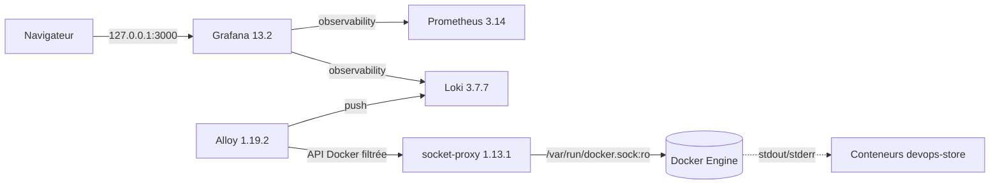

# Design — Centralisation des logs avec Loki et Grafana Alloy

- **Date :** 16 septembre 2026
- **Statut :** proposé, à valider en conversation
- **Périmètre :** phase 12, collecte des logs Docker, Loki 3.7.7, Grafana Alloy 1.19.2 et
  socket-proxy 1.13.1

## Contexte

Le backend Spring Boot émet déjà des logs JSON au format Logstash sur la sortie standard
(`logging.structured.format.console: logstash` dans `backend/src/main/resources/application.yml`).
`RequestIdFilter` place `requestId` dans le MDC pour chaque requête, après validation du motif
`[A-Za-z0-9._-]{1,100}`, et le retire dans un bloc `finally`. Le format Logstash publie sept champs
standard — `@timestamp`, `@version`, `message`, `logger_name`, `thread_name`, `level`,
`level_value` — et remonte chaque entrée MDC comme champ JSON de premier niveau. Aucun
`logback-spring.xml` n'existe et aucune modification du code backend n'est nécessaire pour cette
phase.

La phase 11 a livré le profil Compose `observability` avec Prometheus 3.14 et Grafana 13.2, le
réseau interne `observability` et le réseau partagé externe `devops-store-observability` qui relie
le projet Compose outillage au projet Compose applicatif `devops-store`. Il manque la collecte
durable des logs, leur interrogation depuis Grafana et le parcours d'exploitation associé.

## Objectifs

- collecter les logs de tous les conteneurs du projet applicatif `devops-store` ;
- interroger ces logs dans Grafana à côté des métriques déjà provisionnées ;
- parser le format Docker puis le JSON Logstash du backend sans perdre le contenu original ;
- conserver des labels Loki à faible cardinalité et garder `requestId`, `logger_name` et `message`
  dans le contenu structuré ;
- n'accorder à Alloy aucun accès direct au socket Docker ;
- borner la rétention et l'espace disque locaux ;
- provisionner Loki dans Grafana entièrement depuis des fichiers versionnés ;
- documenter les quatre recherches LogQL imposées par le plan.

## Hors périmètre

- alertes, règles de « ruler » Loki et notifications ;
- stockage objet distant pour Loki (S3/AIStor), multi-tenant et authentification Loki ;
- collecte des logs des profils `quality`, `artifacts` et `registry` ;
- traces distribuées, Tempo et corrélation trace/log ;
- collecte des logs Kubernetes, réservée à la phase 13 ;
- modification du format de log du backend ou ajout de champs applicatifs.

## Décisions validées

| Sujet | Décision |
|---|---|
| Collecteur | Grafana Alloy `grafana/alloy:v1.19.2@sha256:b8ec653c44235fbe910879145dac3597d66b0aaecf60bcbbe82580767771a839` |
| Stockage des logs | Loki single-binary `grafana/loki:3.7.7@sha256:d70e4659623f3e109af669cae76fe2a5dd5be54e2298fe8aed380d982fbc2500` |
| Accès Docker | `wollomatic/socket-proxy:1.13.1@sha256:3935b709275e4ec35d6ed5a5c4a1f0d01ed31eec5e7234efc3357ecd47689002`, socket monté uniquement dans le proxy |
| Périmètre de collecte | Conteneurs portant le label `com.docker.compose.project=devops-store` |
| Labels Loki | `service_name`, `container`, `level` uniquement |
| Contenu conservé | Ligne JSON d'origine, `requestId`, `logger_name` et `message` non promus en labels |
| Rétention Loki | 7 jours, compacteur actif, volume nommé borné |
| Exposition | `3100` (Loki) et `12345` (Alloy) publiés sur `127.0.0.1` uniquement |
| Authentification | `auth_enabled: false`, accès limité au réseau local, aucun secret versionné |
| Profil Compose | Services ajoutés au profil `observability` existant, sans nouveau profil |
| Provisioning Grafana | Datasource Loki d'UID `loki`, panneau de logs ajouté au dashboard `devops-store-backend` |

## Architecture

Trois services sont ajoutés au profil `observability` du projet Compose outillage :

- `socket-proxy` : seul service à monter `/var/run/docker.sock` en lecture seule ; il n'expose
  aucun port sur l'hôte et n'est joignable que depuis le réseau interne `observability` ;
- `alloy` : découvre les conteneurs via l'API Docker du proxy, lit leurs journaux, applique le
  pipeline de traitement et pousse vers Loki ;
- `loki` : stocke les flux sur le système de fichiers dans un volume nommé et sert l'API de requête
  à Grafana.

Loki et Alloy rejoignent `observability` et `observability-shared`. Le second est nécessaire
uniquement pour publier leurs ports de diagnostic sur l'hôte : la phase 11 a établi qu'un réseau
Docker `internal` empêche toute publication de port. `socket-proxy` reste sur le seul réseau
interne.

## Accès Docker restreint

Alloy ne reçoit jamais le socket Docker. `socket-proxy` est une image construite `FROM scratch`,
sans shell ni bibliothèque système, exécutée en `65534:<gid docker>` avec `read_only: true`,
`cap_drop: [ALL]`, `security_opt: [no-new-privileges:true]` et une limite mémoire de 64 Mio.

Les deux seules familles de routes autorisées sont :

- `-allowGET=/v1\..{1,2}/(version|containers|containers/.*)` ;
- `-allowPOST=/v1\..{1,2}/containers/.*/logs`.

Toute autre route, notamment la création, l'exécution ou la suppression de conteneurs, est refusée
par le proxy. Le chien de garde (`-watchdoginterval`, `-stoponwatchdog`) arrête le proxy si le
socket devient indisponible, ce qui rend l'incident visible plutôt que silencieux.

Le GID du groupe `docker` dépend de l'hôte. Sous Docker Desktop et WSL2 il vaut habituellement
`999`. L'implémentation doit le lire réellement avant de figer la valeur et l'exposer par une
variable d'environnement documentée plutôt que par une constante implicite.

## Pipeline Alloy

Le fichier `infrastructure/alloy/config.alloy` enchaîne quatre blocs :

1. `discovery.docker` interroge `tcp://socket-proxy:2375` et liste les conteneurs ;
2. `discovery.relabel` conserve uniquement les conteneurs dont
   `__meta_docker_container_label_com_docker_compose_project` vaut `devops-store`, puis construit
   `service_name` par concaténation du projet et du service Compose — le backend obtient donc
   `devops-store-backend` — et `container` depuis le nom du conteneur ;
3. `loki.source.docker` lit les journaux des cibles retenues et les transmet au traitement ;
4. `loki.process` applique les étapes de parsing, puis `loki.write` pousse vers
   `http://loki:3100/loki/api/v1/push`.

Les étapes de `loki.process` sont :

- `stage.json` extrait `level`, `@timestamp` et `logger_name` du JSON Logstash ;
- `stage.timestamp` utilise `@timestamp` au format RFC3339 avec `action_on_failure: skip`, afin que
  les lignes non JSON conservent l'horodatage Docker ;
- `stage.labels` promeut uniquement `level` ;
- aucune étape ne remplace la ligne : le contenu poussé reste le JSON d'origine, donc `requestId`,
  `logger_name`, `thread_name` et `message` restent interrogeables via `| json` sans peser sur la
  cardinalité de l'index.

Les conteneurs `postgres`, `object-storage` et `frontend` n'émettent pas de JSON Logstash. Leurs
lignes traversent le même pipeline : `stage.json` échoue sans interrompre le flux, `level` reste
absent et la ligne est indexée avec `service_name` et `container` seuls. Ce comportement est voulu
et doit être vérifié explicitement, un échec de parsing ne devant jamais faire tomber le pipeline.

Alloy conserve ses positions de lecture dans un volume nommé monté sur `/var/lib/alloy`, afin qu'un
redémarrage ne réémette pas les journaux déjà poussés.

## Configuration Loki

`infrastructure/loki/loki-config.yml` décrit une instance single-binary :

- `auth_enabled: false`, cible `all`, anneau `inmemory` avec facteur de réplication 1 ;
- schéma `v13` avec index `tsdb` et stockage `filesystem` sous `/loki` ;
- `limits_config` fixe `retention_period: 168h`, `reject_old_samples: true` et une fenêtre
  `reject_old_samples_max_age` compatible avec un démarrage à froid ;
- `compactor` avec `retention_enabled: true` et `delete_request_store: filesystem`, sans quoi la
  rétention déclarée n'est jamais appliquée ;
- `analytics.reporting_enabled: false`.

Le volume `devops-store-loki-data` est nommé et préservé par `observability-down`, supprimé par
`observability-reset` au même titre que les données Prometheus et Grafana.

## Provisioning Grafana

`infrastructure/grafana/provisioning/datasources/` reçoit une datasource Loki d'UID stable `loki`,
en lecture seule, pointant sur `http://loki:3100`. L'UID `prometheus` reste inchangé.

Le dashboard versionné `devops-store-backend` reçoit un panneau supplémentaire de type `logs`,
placé en bas de la grille, avec la requête `{service_name="devops-store-backend"}`. Les neuf
panneaux existants et leurs UID de datasource ne sont pas modifiés.

## Requêtes LogQL documentées

| Besoin | Requête |
|---|---|
| Erreurs backend | `{service_name="devops-store-backend", level="ERROR"}` |
| Avertissements backend | `{service_name="devops-store-backend", level="WARN"}` |
| Contrôleur produits | `{service_name="devops-store-backend"} \| json \| logger_name =~ ".*ProductController"` |
| Service produits | `{service_name="devops-store-backend"} \| json \| logger_name =~ ".*ProductService"` |

Les deux dernières s'appuient sur le contenu structuré et non sur des labels, conformément à la
contrainte de cardinalité.

## Cycle de vie et commandes

Aucun nouveau profil ni nouvelle cible Make n'est créé. Les six cibles d'observabilité existantes
couvrent les trois nouveaux services une fois ceux-ci ajoutés au profil :

- `observability-config` valide aussi les configurations Loki et Alloy ;
- `observability-up` démarre l'application puis `prometheus`, `grafana`, `loki`, `alloy` et
  `socket-proxy` ;
- `observability-down` arrête les cinq services en conservant les volumes ;
- `observability-status`, `observability-logs` couvrent les nouveaux services ;
- `observability-reset` supprime les données locales Prometheus, Grafana et Loki.

Les listes explicites de services dans le `Makefile` (`up -d --wait prometheus grafana`,
`stop grafana prometheus`, `rm -f grafana prometheus`) doivent être étendues, sans quoi les
nouveaux services seraient démarrés mais jamais arrêtés par la recette.

L'ordre de démarrage est `socket-proxy` puis `loki`, puis `alloy` qui dépend des deux avec
`condition: service_healthy`.

## Sondes de santé

Les trois images sont minimales et ne disposent pas nécessairement d'un shell ni de `curl`. La
phase 11 a déjà échoué trois fois sur ce point avec Grafana. L'implémentation doit donc sonder
chaque image avant de figer une recette, avec les candidats suivants :

| Service | Point de contrôle | Sonde candidate |
|---|---|---|
| Loki | `/ready` sur `3100` | `wget --spider -q http://localhost:3100/ready` |
| Alloy | `/-/ready` sur `12345` | `/bin/alloy tools ...` ou sonde HTTP présente dans l'image |
| socket-proxy | `-allowhealthcheck` | sonde interne fournie par l'image |

Si aucune sonde fiable n'existe dans une image, le service reste sans `healthcheck` et la
dépendance correspondante utilise `condition: service_started`, la vérification étant alors faite
par les commandes de validation documentées.

## Sécurité et durcissement

Les trois services reprennent le gabarit de la phase 11 : `read_only: true`, `tmpfs` dédié pour
`/tmp`, `cap_drop: [ALL]`, `security_opt: [no-new-privileges:true]`, `restart: unless-stopped`,
limites `cpus`, `mem_limit` et `pids_limit`, exécution en utilisateur non root. Loki écrit
uniquement dans son volume et son `tmpfs` ; Alloy uniquement dans son volume de positions.

Aucun secret n'est introduit. Loki n'a pas d'authentification et n'est donc joignable que depuis le
réseau Docker et `127.0.0.1`. Les journaux collectés peuvent contenir des identifiants techniques
de corrélation mais aucun secret applicatif : le critère d'acceptation correspondant est vérifié par
une inspection réelle des lignes émises.

## Gestion des erreurs

| Situation | Comportement attendu |
|---|---|
| Socket Docker indisponible | `socket-proxy` s'arrête via le chien de garde ; Alloy échoue visiblement |
| GID `docker` incorrect | Le proxy ne peut pas lire le socket ; erreur explicite au démarrage, pas de collecte silencieuse |
| Ligne non JSON | Indexée avec `service_name` et `container`, sans label `level` |
| Horodatage hors fenêtre | Entrée rejetée par Loki avec un message explicite ; la fenêtre est documentée |
| Loki indisponible | Alloy réessaie avec sa file interne ; les journaux Docker restent lisibles par `docker compose logs` |
| Redémarrage d'Alloy | Les positions persistées évitent la réémission |
| Volume Loki plein | La rétention et le compacteur bornent la croissance ; le diagnostic est documenté |

## Validation

### Statique

- `docker compose --profile observability config --quiet` sur le modèle outillage ;
- vérification de la configuration Loki par l'option de contrôle de l'image ;
- `alloy fmt` et validation de `config.alloy` par l'outillage de l'image ;
- contrôle des UID de datasource et du nombre de panneaux du dashboard ;
- `git diff --check`.

### Dynamique

1. démarrer l'application puis le profil `observability` ;
2. vérifier que les cinq services sont sains ou démarrés selon la décision de sonde ;
3. `curl.exe http://localhost:3100/ready` et `curl.exe http://localhost:12345/-/ready` ;
4. générer du trafic applicatif réel, y compris une erreur volontaire, en réutilisant le script
   d'acceptance de la phase 11 — l'en-tête `Origin: http://localhost:4200` reste obligatoire pour
   l'authentification ;
5. interroger
   `curl.exe -G http://localhost:3100/loki/api/v1/query_range --data-urlencode "query={service_name=\"devops-store-backend\"}"`
   et vérifier la présence des champs `level`, `logger_name` et `requestId` dans le contenu ;
6. exécuter les quatre requêtes LogQL imposées et constater des résultats lorsque les événements
   existent ;
7. vérifier dans Grafana que le panneau de logs affiche un log récent avec horodatage, niveau et
   logger ;
8. inspecter les lignes collectées pour confirmer l'absence de secret, de prix et de description
   produit ;
9. arrêter l'observabilité et vérifier que l'application reste saine et que les volumes sont
   préservés.

### Régression

- `docker compose config --quiet` sur le modèle applicatif ;
- `promtool check config` sur la configuration Prometheus inchangée ;
- passes Trivy de configuration sur le dépôt et les modèles Compose.

## Documentation

- `docs/observability/loki.md` : rôle, configuration, rétention, commandes et diagnostic ;
- `docs/observability/alloy.md` : pipeline, périmètre de collecte, socket-proxy et labels ;
- `docs/observability/grafana.md` : datasource Loki et panneau de logs ;
- `docs/README.md`, `README.md` et `AGENTS.md` : nouveaux services, ports et commandes ;
- `docs/IMPLEMENTATION_PLAN.md` : versions réelles retenues (Loki 3.7.7 et Alloy 1.19.2 au lieu de
  3.7 et 1.18) et statut daté de la phase 12.

## Critères d'acceptation

- [ ] Un log backend récent est visible dans Grafana avec horodatage, niveau et logger.
- [ ] Les quatre recherches imposées retournent des résultats quand les événements existent.
- [ ] Aucun secret, prix ou description produit n'est ajouté aux logs applicatifs.
- [ ] Alloy ne monte pas le socket Docker et ne collecte que les conteneurs du projet
      `devops-store`.
- [ ] Les labels Loki se limitent à `service_name`, `container` et `level`.
- [ ] `observability-down` préserve les données Loki et `observability-reset` les supprime.

## Références

- `docs/superpowers/specs/2026-08-31-prometheus-grafana-observability-design.md` ;
- `docs/IMPLEMENTATION_PLAN.md`, phase 12 ;
- documentation Spring Boot sur les logs structurés au format Logstash ;
- documentation Grafana Alloy `discovery.docker`, `loki.source.docker`, `loki.process` ;
- documentation Loki single-binary, schéma `v13` et compacteur ;
- dépôt `wollomatic/socket-proxy`, options d'allowlist et durcissement.
